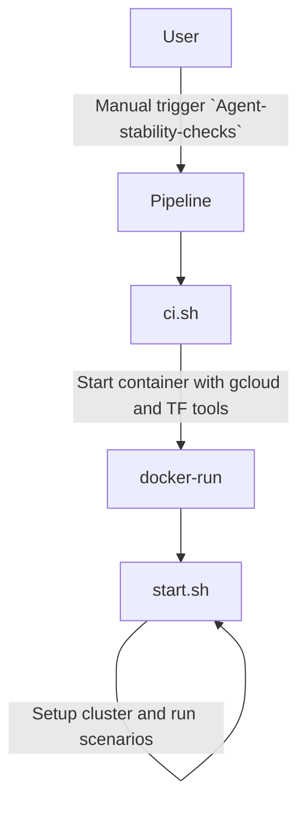

# Agent release

This folder contains the pipeline and scripts for the agent release process.

## Folder content

- **[gcp-tf](gcp-tf/README.md):** Terraform scripts to create the GCP cluster
- **[k8s-gcp-tools](k8s-gcp-tools/README.md):** Dockerfile to build the image that contains needed tools (kubectl, helm, terraform, gcloud)
- **[pipeline](pipeline/README.md):** The pipeline template and the script to generate the pipeline.yaml
- **[scenarios](scenarios/README.md):** The scenarios scripts that will deploy different scenarios on the cluster
- **ci.sh:** A script the pipeline uses to start the k8s-gcp-tools container.
- **start.sh:** This script runs inside the k8s-gcp-tools container and is used to provision the gke cluster and run the scenarios.

## How it works

The release process is divided into 3 steps:
 - [RC release](#rc-release)
 - [RC checks and stabilization pipeline:](#rc-checks-and-stabilization-pipeline)
 - [Release RC to GA](#release-rc-to-ga)

### RC release

RC version is created in two scenarios:
* Scenario 1: A helm-chart feature branch is merged to master.
* Scenario 2: A new agent version is released and as a result a new helm-chart version is created.
In each scenario a new RC version is created.
The RC version number is automatically created based on the last GA/RC tags.

In case the last GA version was `1.1.1` the new RC version will be `1.1.1+RC1`.
> NOTE: The `+RC1` means that this is the first RC version on top of GA version `1.1.1`.

### RC checks and stabilization pipeline:

Once we decide to promote RC version to GA, we will use [this pipeline](https://buildkite.com/komodor/agent-stability-checks) to validate that we are releasing a stable version of the agent.
The following are the release steps:

1. The `release-check` pipeline is triggered manually
2. The pipeline collects all the RC versions that are candidates for the next  GA release.
3. The pipeline waits for two user inputs:
    1. Select RC version to check & release
    2. Work mode (GA or Hotfix)
        > Hotfix mode is used to release a new version of the agent without executing all the check scenarios.
4. The pipeline continue with the following steps:
    1. Create K8S cluster in GCP using [terraform](gcp-tf/README.md#running-terraform)
    2. Deploy the scenarios data to the cluster
    3. Install two komodor-agents on the cluster
       * The RC version that we want to check
       * The last GA version
       > NOTE: Installing two agents will allow us to compare the two versions.
    4. Wait for test timeout (default is 1 hour)
    5. Cleanup the cluster
    6. Remove the cluster.
5. The pipeline will wait for the user to choose how to increase the version number:
6. Trigger agent release pipeline (`Release RC to GA`)

### Release RC to GA

* The regular [helm-chart](https://buildkite.com/komodor/helm-charts) pipeline is triggered by the previous pipeline.
* It will bump the selected RC version based on the user input in the previous pipeline.
* The user will have to unblock the pipeline and approve the release.
   > NOTE: The pipeline will wait for the user to unblock to allow the user to create a release-note for the new version.
* Publish the new charts.

## How to run things manually

* [Terraform](gcp-tf/README.md#how-to-use-it-manually)
* [Scenarios](scenarios/README.md#running-scenarios)

## Pipeline flow:

